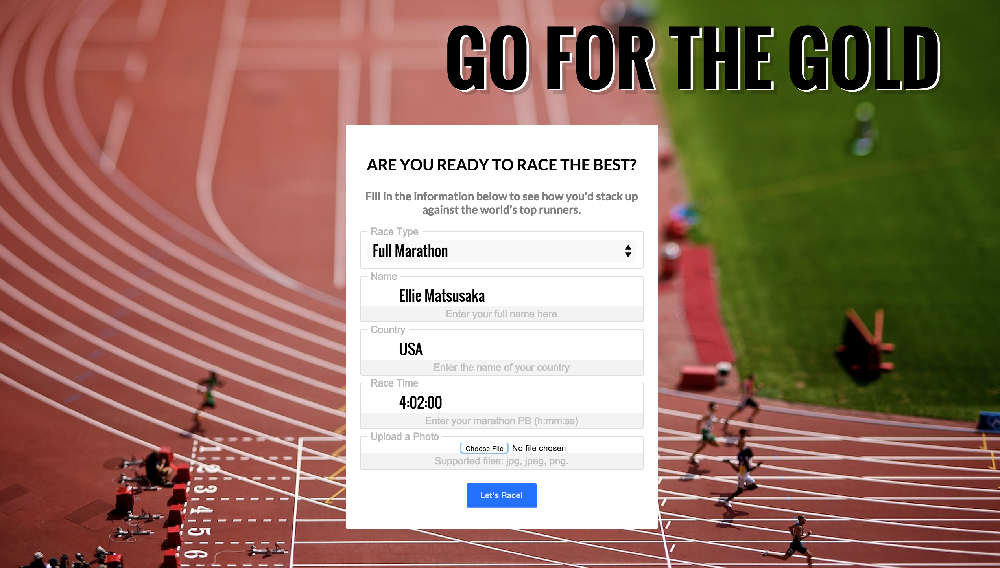
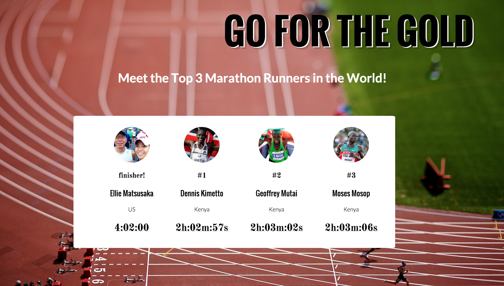

# GO FOR THE GOLD
**Go for the Gold** is a fun web-app to show runners how their PB's (personal records for all you non-runners out there) compare against the top runners in the world. Hopefully **Go for the Gold** will server as a little inspiration on those long morning runs! 

## Getting Started:

Setup for Go for the Gold is simple as pie. 
 

First, clone down the repo: 
  `git clone https://github.com/ematsusaka/go-for-the-gold.git && cd go-for-the-gold`
   

Second, install the dependencies: 
  `npm install`
   

Last but not least, we'll get our server started up: 
  `cd src && nodemon server.js`
   
   
  
You should see a congratulatory message in the console. If not, I recommend retrying steps 1-3. 

Now, navigate to `localhost:3000` in your broswer of choice. 

You're up and running! Enjoy! 

##### Side Note:

I'm sure you would love to upload a **.jpg, .jpeg, .png** of yourself in the race form. Sadly this feature is not fully implemented (but one day it will be). Until then you get to see a hard-coded photo of my dad and me at the San Diego Marathon. Your picture to come soon!

### Background:

This idea blossomed from a fond memory I have from running in the Houston Half Marathon. After a grueling 13 miles, I rounded the last bend into the last stretch with a ROARING crowd in Downtown Houston. 
 

Naturally I felt like a celebrity, soaking up the glory of the limelight... until I realized Tarika Juvar of Ethiopia was flying down the elite stretch right next to me. As I was pulling in a great 13.1 mile time, Juvar was pulling in a great 26.2 mile time... and beat me by 15 seconds. It was a close. 
 

This funny memory has always inspired me during training and is a great reminder of what any human is capable of with enough hard work! 

To all you runners out there, remember to *always* **Go for the Gold**!

